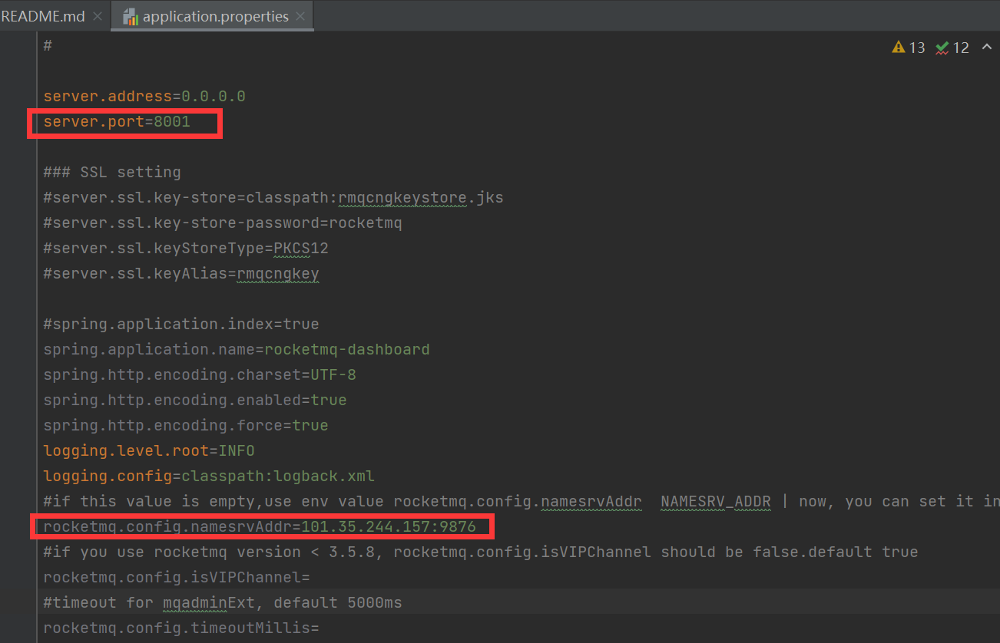

RocketMQ记录：
网上的教程跟着走，但是可视化面板就是连接不上远程nameserver，最后发现原因是Ubuntu没有开放相应端口。。。
云服务器的安全组策略已经开放相应端口，但是没用，那是虚拟防火墙，需要开放Ubuntu系统里的端口
sudo ufw status    #查看端口开放情况
sudo ufw allow 9876    #开放9876、10909、10911端口

官网面板源码配置要改的：
